# 用户帮助

一个对校园二手交易平台的帮助说明

## 首页

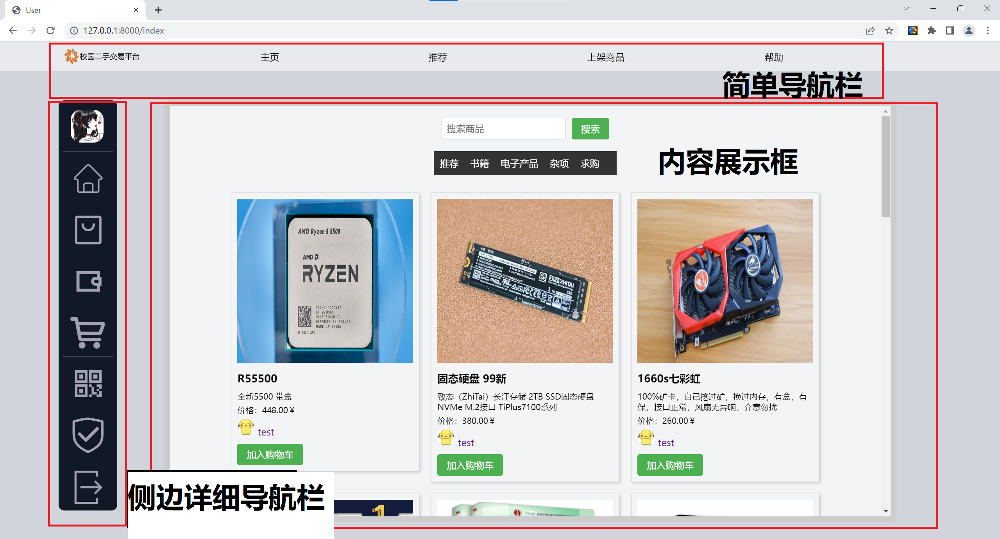

### 简单导航栏

方便用户快速浏览网站的内容，提高用户体验。
提供主页跳转、推荐、上架以及帮助的快捷键

### 侧边详细导航栏

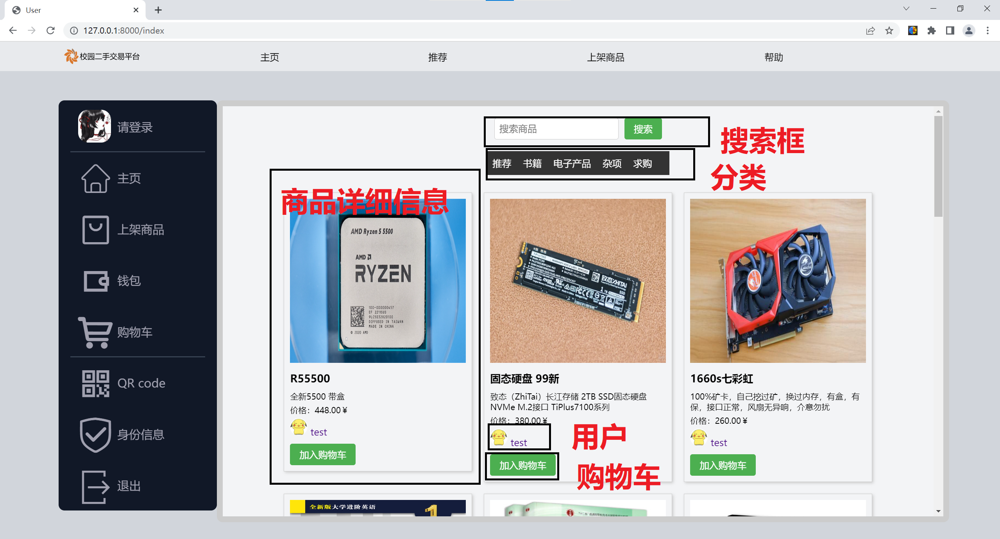

提供详细的导航键
登录、主页、上架、钱包、购物车、qr、身份设置、退出等

### 内容展示框

展示导航内容

## 登录、注册

### 登录

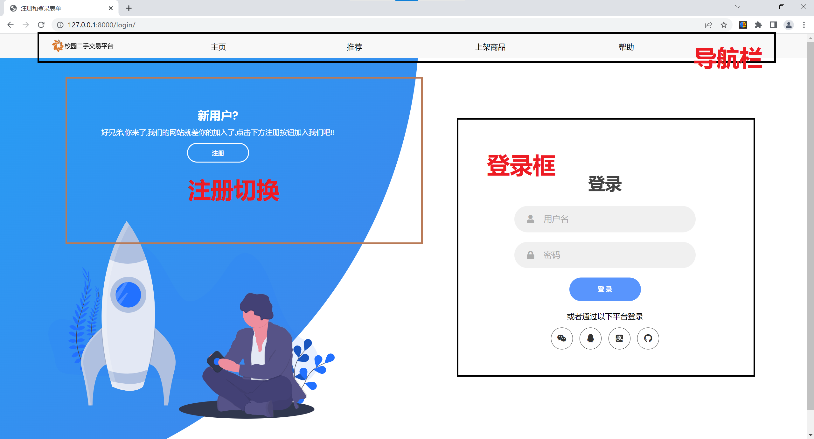

1.有账号
可直接账户和密码登录
2.无账号
点击注册
切换到注册页面
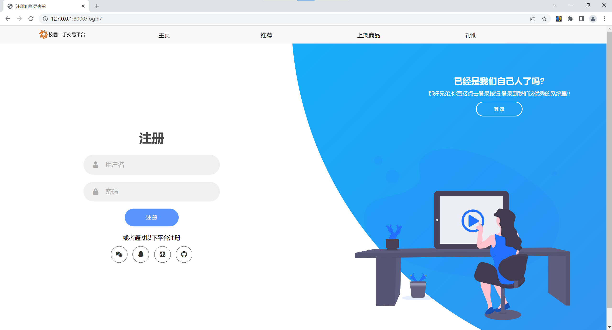
输入注册的账号密码、注册
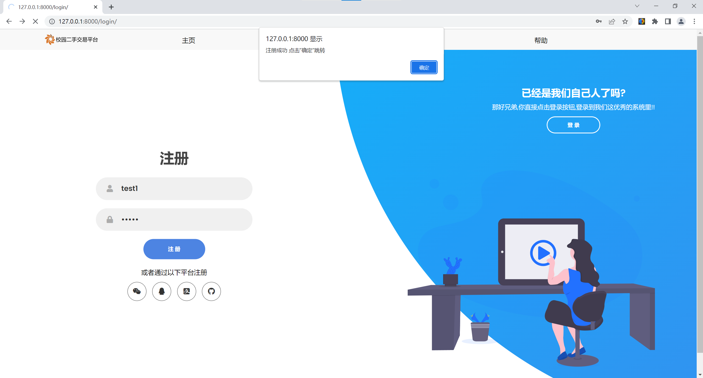
注册成功后点击"确认"即可跳转

### 注册

点击注册
切换到注册页面

输入注册的账号密码、注册

注册成功后点击"确认"即可跳转
  
## 主页

### 详细商品信息

提供详细信息

### 搜索框

提供搜所功能

### 分类

方便查找商品

### 用户

用于查看用户信息和，所售卖商品

### 加入购物车

将商品加入个人购物车

## 商品上架

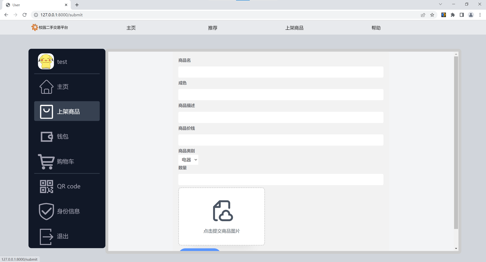

用于提交商品

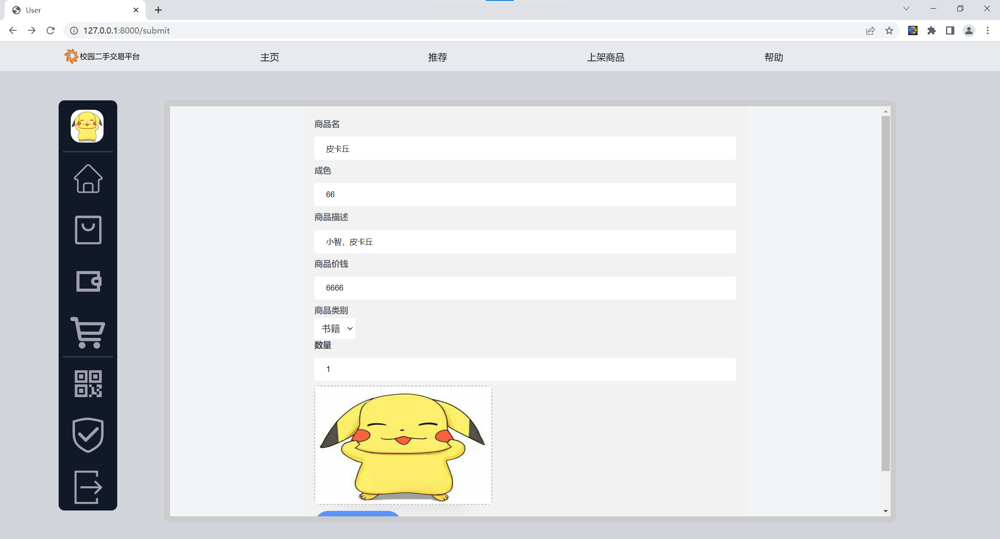

提交后会在个人主页显示，在主页面可以进行上下架操作，以及设置商品信息

## 钱包

钱包显示用信息，注册时间等
也可以进行充值等操作

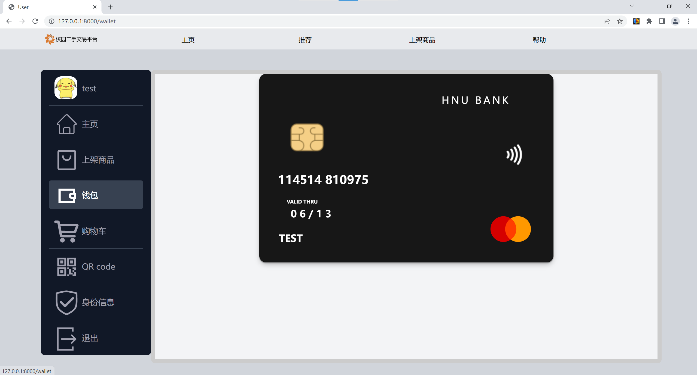

防止钱包处可查看余额

## 购物车

初始未加入商品时

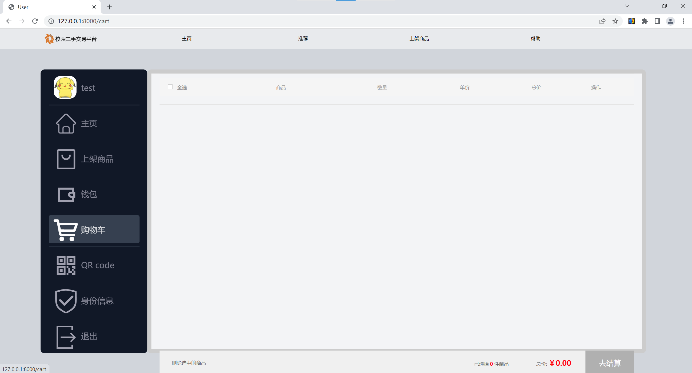

加入购物车后

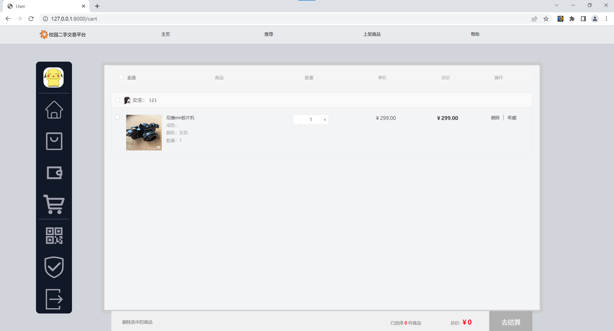

可进行结算操作

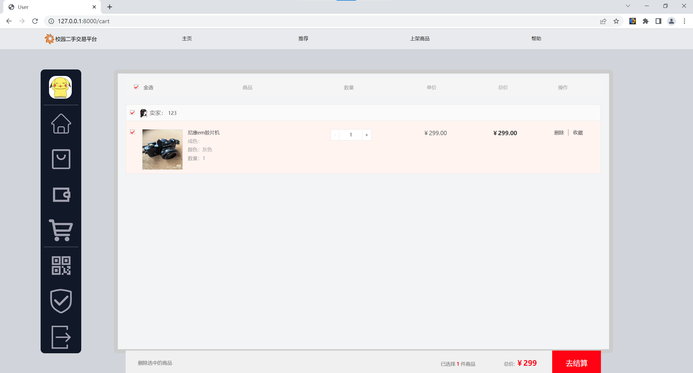

### QR

提供一个QR图用于客户分享，寻找自己客户

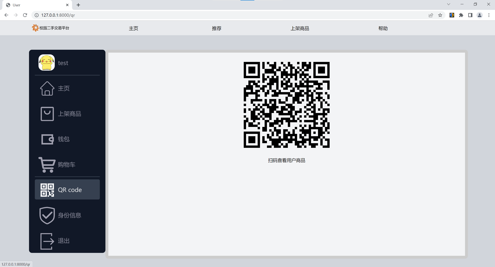

### 身份信息

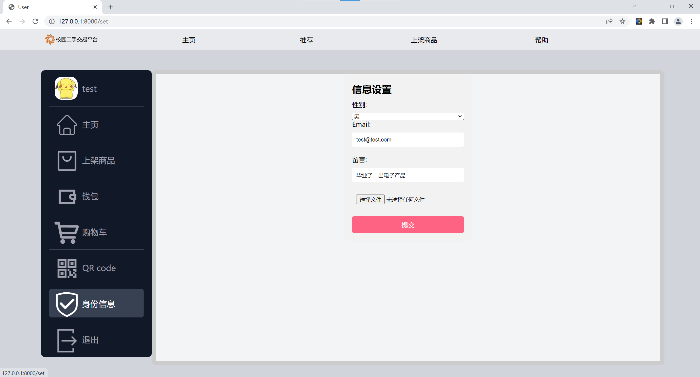

用于设置、修改用户个人信息

### 退出登录

退出当前用户

# 管理员帮助

## 管理员注册

管理员注册须向运维人员或admin用户申请账号
本系统不提供相关接口

## 管理员登录

输入网站："域名"/admin/

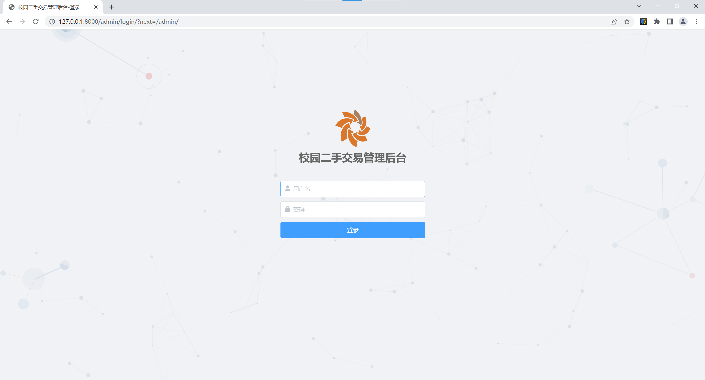

管理员主页面

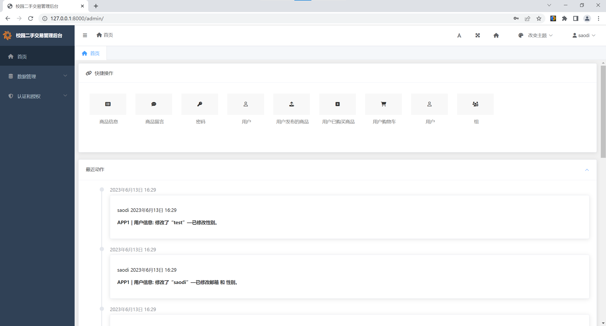

打开后台数据管理

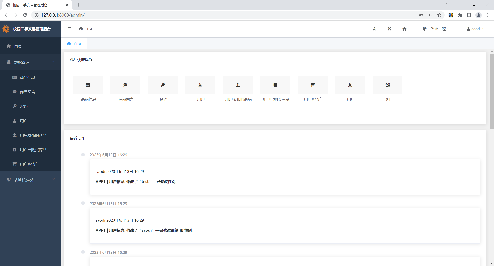

## 查看后台数据

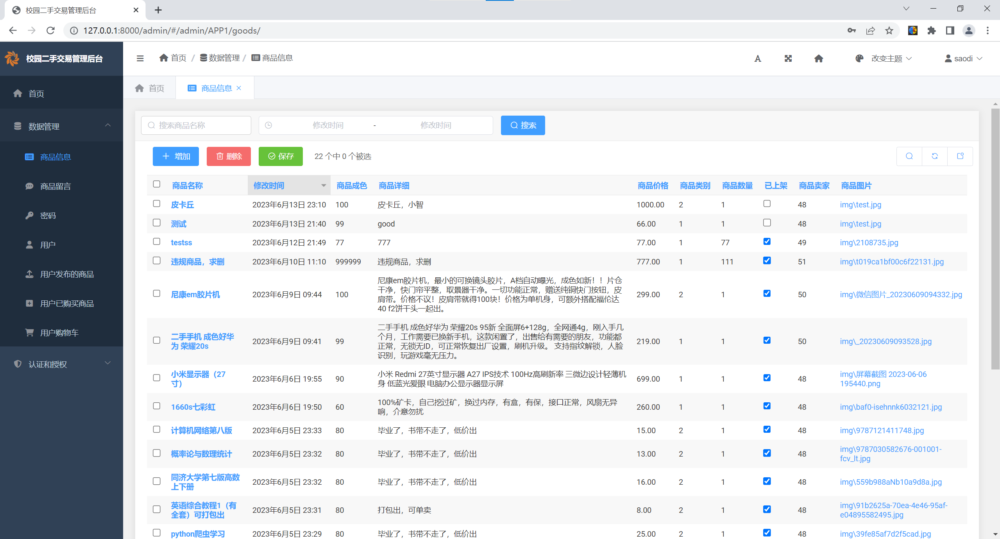

## 修改、删除后台数据

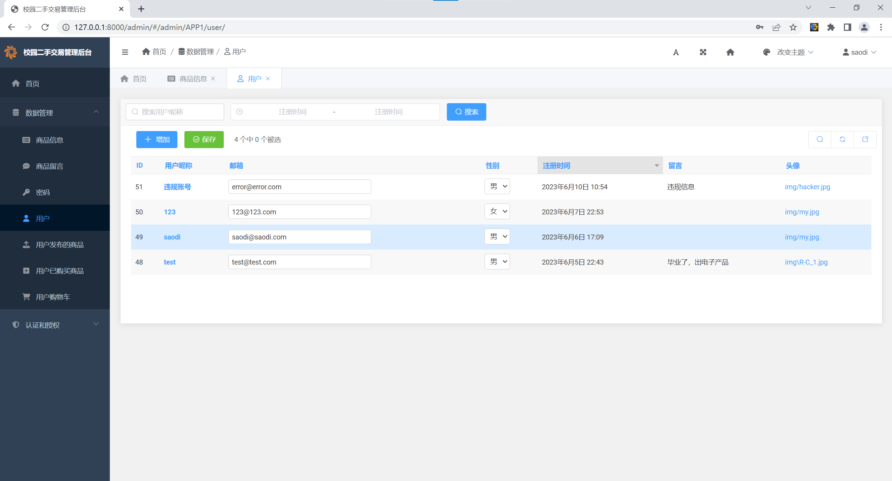

## 恭喜你了解了本系统的使用方法

感谢你对本系统的支持
